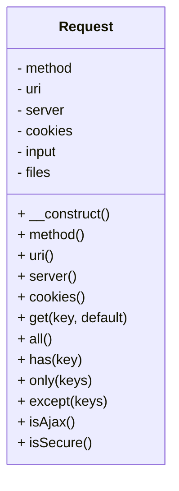

In the above code:

- We use the `classDiagram` directive to define a class diagram.
- Inside the diagram, we define the `Request` class with its properties (prefixed with `-`) and methods (prefixed with `+`).
- Each method and property is listed with its visibility (- for private, + for public) and name.

Please note that you need to use a Markdown editor or viewer that supports Mermaid.js to render this diagram correctly. You may also need to configure your Markdown processing pipeline to handle Mermaid diagrams if you're using a static site generator or similar tool.

# Request Class Documentation

The `Request` class is a PHP class designed to encapsulate and provide easy access to various aspects of an HTTP request. It abstracts data such as the HTTP method, URI, server variables, cookies, input data, and uploaded files. This class is particularly useful when working with web applications or frameworks to handle incoming HTTP requests.

## Constructor

### `public function __construct()`

The constructor initializes the `Request` object by populating its properties with data from PHP's global `$_SERVER`, `$_COOKIE`, `$_REQUEST`, and `$_FILES` arrays.

## Methods

### `public function method()`

Returns the HTTP request method (e.g., GET, POST, PUT, DELETE) used for the current request.

### `public function uri()`

Returns the URI (Uniform Resource Identifier) of the current request, including query parameters if any.

### `public function server()`

Returns an array containing all the server variables for the current request (e.g., headers, host information).

### `public function cookies()`

Returns an array of all cookies sent with the current request.

### `public function get($key, $default = null)`

Retrieves a value from the input data (e.g., query parameters, form fields) using the specified key. If the key does not exist, it returns the default value provided.

### `public function all()`

Returns an array containing all input data, including both query parameters and uploaded files.

### `public function has($key)`

Checks if a key exists in the input data (e.g., query parameters, form fields). Returns `true` if the key exists; otherwise, returns `false`.

### `public function only($keys)`

Returns an array containing only the specified keys from the input data. If a key does not exist, it is omitted from the result.

### `public function except($keys)`

Returns an array containing all input data except for the specified keys. This method removes the specified keys from the input data.

### `public function isAjax()`

Checks if the current request was made using AJAX (Asynchronous JavaScript and XML) by inspecting the `HTTP_X_REQUESTED_WITH` header. Returns `true` if the request is an AJAX request; otherwise, returns `false`.

### `public function isSecure()`

Checks if the current request is made over a secure connection (HTTPS) by inspecting the `HTTPS` server variable. Returns `true` if the connection is secure; otherwise, returns `false`.

## Example Usage

Here's an example of how you might use the `Request` class in a PHP application:

```php
// Create a new Request object
$request = new Request();

// Get the HTTP method (e.g., GET, POST)
$method = $request->method();

// Get the URI
$uri = $request->uri();

// Check if it's an AJAX request
$isAjax = $request->isAjax();

// Get a specific query parameter
$searchTerm = $request->get('q', '');

// Get all input data (query parameters and uploaded files)
$inputData = $request->all();

// Check if a specific key exists in the input data
if ($request->has('user_id')) {
    // Handle the user_id parameter
}

// Get only specific keys from the input data
$selectedData = $request->only(['username', 'email']);

// Get all input data except for certain keys
$filteredData = $request->except(['password']);

// Check if the connection is secure (HTTPS)
$isSecure = $request->isSecure();
